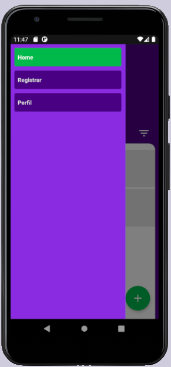

# Finanças


## Tecnologias utilizadas

```sh
- [x] React Native 
- [x] Vector Icons
- [x] Picker Select
- [x] Styled Components
- [x] Date FNS
- [x] Date Time Picker
- [x] Async Storage
- [x] Firebase
```


## Executando a aplicação (execute via terminal/cmd)

Para executar o projeto, deixe o emulador aberto android/IOS. Navegue até a pasta do projeto e execute os comandos:
```sh
  $  `npm install` ou `yarn install`<br /> # para instalar as dependências
  $ `react-native run-android` para android `react-native run-android`<br /> # inicializando o package.json
```
Pronto!!

## Imagens do projeto rodando

<div align="center">
    
</div>

<div align="center">
    
</div>

<div align="center">
    
</div>

<div align="center">
    
</div>